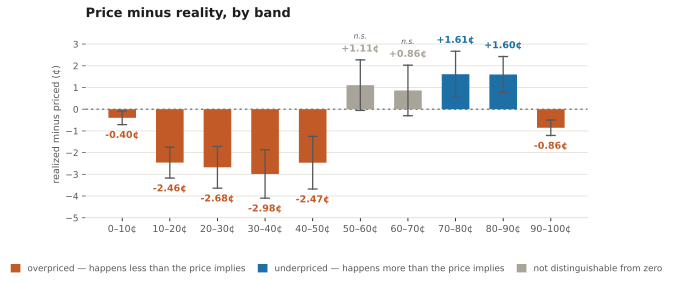

# Kalshi-Favorite-Longshot-Bias-Study

Do prediction-market prices tell the truth about probability? If a Kalshi
contract trades at 30¢, the market is claiming a 30% chance. This checks
whether that claim holds — gather every contract that traded near 30¢, and see
how many actually happened.

This is a test for the **favorite-longshot bias**, a pattern first noticed at
racetracks: people underpay for high-probability events and overpay for
low-probability ones.

---

## What we found


Every settled contract is pooled into ten price bands (0–10¢, 10–20¢, ... 90–100¢).
If Kalshi's prices were perfect probabilities, a band would resolve YES exactly as
often as its own price says. The chart below shows how far off each band actually
was, in cents, with a 95% confidence interval on each bar:



| color | meaning |
|---|---|
| 🟧 orange | **overpriced** — the band happened *less* often than its price implied |
| 🟦 blue | **underpriced** — the band happened *more* often than its price implied |
| ⬜ gray, "n.s." | bar isn't statistically distinguishable from zero |

Reading left to right, cheapest contracts to most expensive: every band under 50¢
is overpriced, every band from 50¢ to 90¢ is underpriced — the sign flips cleanly
at the 50¢ coin-flip point — and the 90–100¢ band unexpectedly flips back to
overpriced (see "Heavy favorites at 90¢+" below).

### Brier score decomposition

**The prices are good.** Brier score **0.1213** — the mean squared error
between each forecast (a probability, e.g. 0.30) and what actually happened
(1 if it did, 0 if it didn't); 0 is a perfect forecaster, 1 is the worst
possible one. On its own that number says little, because a market can score
badly for two opposite reasons: it lies about probabilities, or it faces
genuinely coin-flip questions. The **Murphy decomposition** splits the score
into exactly those pieces:

| term | plain meaning | value | direction |
|---|---|---|---|
| **uncertainty** | how random the questions were to begin with — the variance of the base rate, 45.12% of contracts settle YES. A floor no forecaster can get under. | **0.2476** | fixed by the questions |
| − **resolution** | how far the market's prices move away from that flat base-rate guess — its ability to tell likely outcomes from unlikely ones. Subtracted, so **more is better**. | **0.1258** | earned |
| + **reliability** | calibration error — how far a price drifts from the frequency it actually happens at. This is the only part the market is getting *wrong*. | **0.00029** | the mistake |
| + binning residual | rounding from sorting prices into ten buckets rather than measuring each price exactly — 0.6% of the score, so the buckets aren't distorting anything. | **−0.00075** | artefact |
| **= Brier score** | | **0.1213** | |

Read down that column: almost the entire score is the questions' own randomness
(0.2476) minus real forecasting skill (0.1258). The part the market could
actually fix — reliability, at three ten-thousandths — is a rounding error next
to both. And note that resolution being large is a *good* thing: a forecaster
who answers every question with the base rate is perfectly calibrated and
completely useless.

In plain terms: when Kalshi says 30%, it happens about 30% of the time.

**But there's a small favorite-longshot bias, in the direction theory
predicts.** Contracts below 50¢ happen *less* often than their price claims;
above 50¢, *more* often — cheap contracts are slightly overpriced, expensive
ones slightly underpriced. Peak gap: **2.98¢**, in the 30–40¢ range. 8 of 10
buckets are big enough to rule out luck.

It's biggest in short-lived markets (open under 15.6h: off by up to 5.5¢) and
may be much bigger outside sports (Economics: a 13.7¢ gap, but on only 186
events — a lead, not an answer).

Full numbers: **[docs/findings.md](docs/findings.md)**.

## Two problems that shaped the project

**The obvious price is the answer in disguise.** A settled market's
`last_price` is 92.5% snapped to the final result — most Kalshi markets live
about a day, so by close there's no uncertainty left to measure. Fix: price
each contract from its last trade **one hour before close**, dropping the
snapped rate to 1.1%. [design decision doc 003](docs/adr/003-implied-price-definition.md).

**Contracts aren't independent.** "Who wins the PGA Championship" is 250
contracts, one per golfer, one winner — one result written 250 ways, not 250
separate facts. Fix: group by event and do the statistics on events, which
costs the most exactly where the bias lives.
[design decision doc 005](docs/adr/005-bucketing-and-tests.md).

## How it's measured

Ten price buckets, the Brier score split via Murphy decomposition into
reliability, resolution, and uncertainty (see above), error bars that account
for event grouping (clustered standard errors, since 250 golfers in one
tournament are 250 correlated outcomes, not 250 independent ones), and a
Benjamini–Hochberg correction for testing all ten buckets at once (so one
lucky bucket out of ten can't masquerade as a real finding). Method:
**[docs/methodology.md](docs/methodology.md)**.
Reasoning behind each choice: [docs/adr/](docs/adr/) (backtest design in
[006](docs/adr/006-train-test-split.md)/[007](docs/adr/007-strategy-and-sizing.md)).
Day-to-day log: [docs/journal.md](docs/journal.md).

## Running it

```bash
pip install -r requirements.txt
make ingest          # settled markets    -> data/raw/        (resumable)
make ingest-trades   # a price at T-1h    -> data/raw_trades/ (resumable, ~3.5h)
make clean           # raw -> interim -> processed
make analyze         # tables + backtest -> reports/*.csv
make figures         # figures -> reports/figures/
make test            # 232 tests
```

Same input, same output — the random seed is fixed in `config.yaml`. Nothing
is hardcoded: bucket count, confidence level, fee schedule, and the rest are
all config settings.

## What this doesn't show

The real cost of trading (the spread isn't in the data — see "under one cent"
above). Only Kalshi, only six months, only the one-hour-before-close price.
Heavy favorites at 90¢+ go the *wrong* way, unexplained. The out-of-sample
backtest window is short (~7 weeks) and almost entirely sports. Full list, with
what would change each one: [docs/limitations.md](docs/limitations.md).
