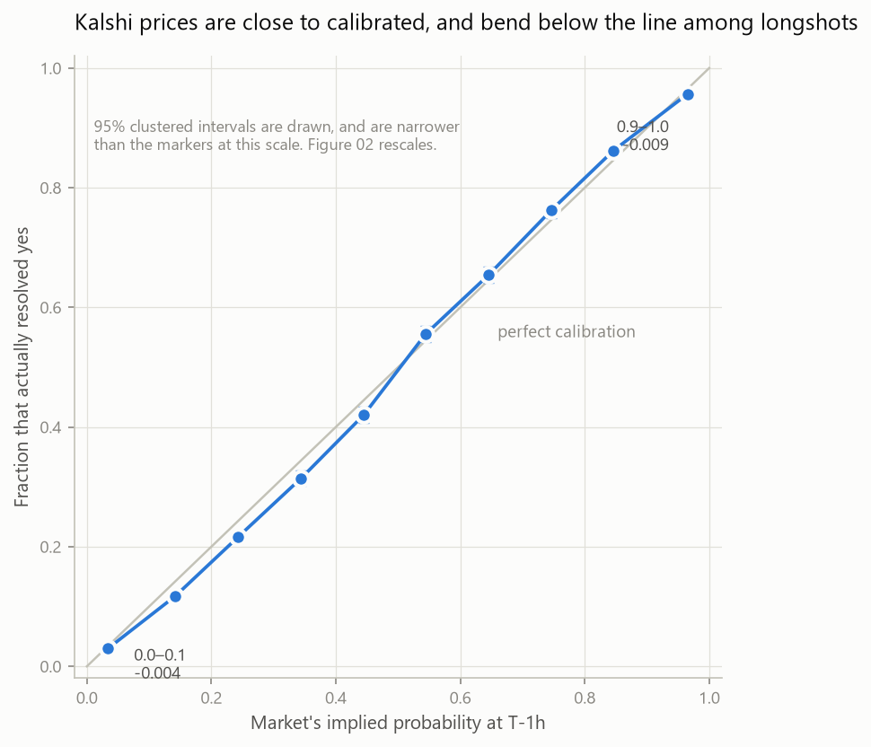

# Kalshi-Favorite-Longshot-Bias-Study

Do prediction-market prices tell the truth about probability? If a Kalshi
contract trades at 30¢, the market is claiming a 30% chance. This checks
whether that claim holds — gather every contract that traded near 30¢, and see
how many actually happened.

This is a test for the **favorite-longshot bias**, a pattern first noticed at
racetracks: people underpay for high-probability events and overpay for
low-probability ones.

---

## What we found



**The prices are good.** Brier score 0.1213 — a single number, from 0 (perfect)
to 1 (worst possible), that scores a set of probability forecasts against what
actually happened — and almost none of that error is miscalibration: when
Kalshi says 30%, it happens about 30% of the time.

**But there's a small favorite-longshot bias, in the direction theory
predicts.** Contracts below 50¢ happen *less* often than their price claims;
above 50¢, *more* often — cheap contracts are slightly overpriced, expensive
ones slightly underpriced. Peak gap: **2.98¢**, in the 30–40¢ range. 8 of 10
buckets are big enough to rule out luck.

It's biggest in short-lived markets (open under 15.6h: off by up to 5.5¢) and
may be much bigger outside sports (Economics: a 13.7¢ gap, but on only 186
events — a lead, not an answer).

Full numbers: **[docs/findings.md](docs/findings.md)**.

## Two problems that shaped the project

**The obvious price is the answer in disguise.** A settled market's
`last_price` is 92.5% snapped to the final result — most Kalshi markets live
about a day, so by close there's no uncertainty left to measure. Fix: price
each contract from its last trade **one hour before close**, dropping the
snapped rate to 1.1%. [design decision doc 003](docs/adr/003-implied-price-definition.md).

**Contracts aren't independent.** "Who wins the PGA Championship" is 250
contracts, one per golfer, one winner — one result written 250 ways, not 250
separate facts. Fix: group by event and do the statistics on events, which
costs the most exactly where the bias lives.
[design decision doc 005](docs/adr/005-bucketing-and-tests.md).

## How it's measured

Ten price buckets, Brier score split into its three parts (Murphy
decomposition), error bars that account for event grouping, and a correction
for testing ten buckets at once. Method: **[docs/methodology.md](docs/methodology.md)**.
Reasoning behind each choice: [docs/adr/](docs/adr/) (backtest design in
[006](docs/adr/006-train-test-split.md)/[007](docs/adr/007-strategy-and-sizing.md)).
Day-to-day log: [docs/journal.md](docs/journal.md).

## Running it

```bash
pip install -r requirements.txt
make ingest          # settled markets    -> data/raw/        (resumable)
make ingest-trades   # a price at T-1h    -> data/raw_trades/ (resumable, ~3.5h)
make clean           # raw -> interim -> processed
make analyze         # tables + backtest -> reports/*.csv
make figures         # figures -> reports/figures/
make test            # 232 tests
```

Same input, same output — the random seed is fixed in `config.yaml`. Nothing
is hardcoded: bucket count, confidence level, fee schedule, and the rest are
all config settings.

## What this doesn't show

The real cost of trading (the spread isn't in the data — see "under one cent"
above). Only Kalshi, only six months, only the one-hour-before-close price.
Heavy favorites at 90¢+ go the *wrong* way, unexplained. The out-of-sample
backtest window is short (~7 weeks) and almost entirely sports. Full list, with
what would change each one: [docs/limitations.md](docs/limitations.md).
